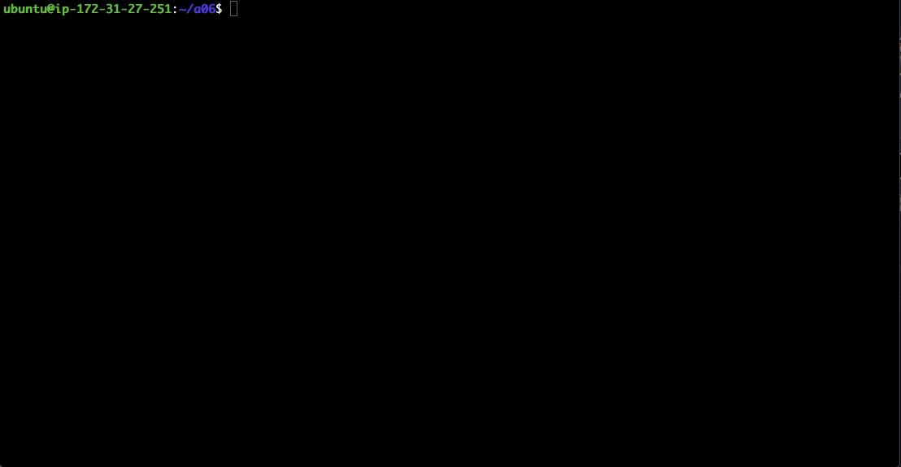
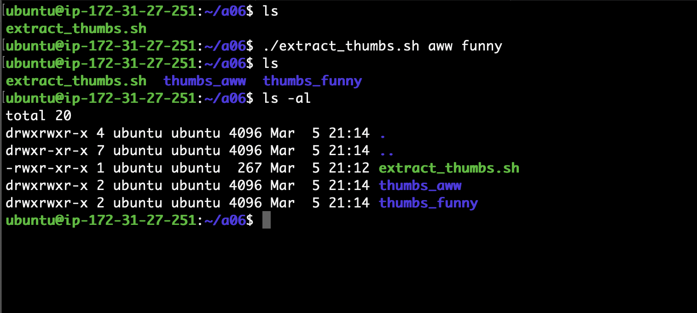
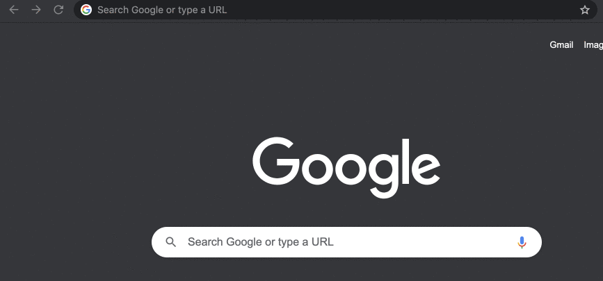
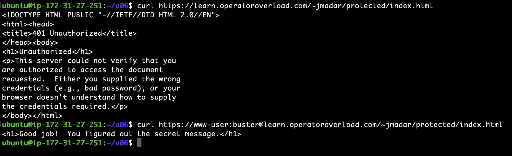
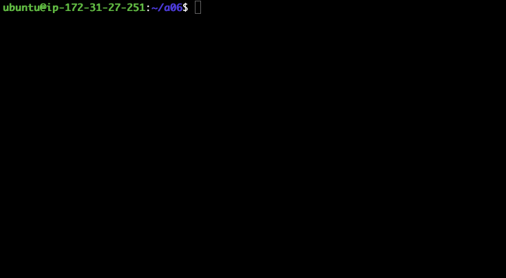

# Linux Bash Challenge

Below are a couple of additional challenges on bash scripting

# Question 1

Regex is great because of the ability to extract information from unstructured sources
(instead of relying on delimiters). To demonstrate, write a script that extracts all
thumbnail images from a particular subreddit.

<ol type='a'>

<li>
Come up with a bash one-liner that extracts all the image URLs from
https://www.reddit.com/r/aww.json where the URLs starts with
https://i.redd.it/ and ends with png, jpg, or gif.  For example, the
following is a partial result of my output:

```
https://i.redd.it/6aic0hoye0x41.jpg
https://i.redd.it/award_images/t5_22cerq/12kz7a7j4v541_HeartEyes.png
https://i.redd.it/award_images/t5_22cerq/n94bgm83in941_ItsCute.png
https://i.redd.it/award_images/t5_22cerq/5izbv4fn0md41_Wholesome.png
https://i.redd.it/award_images/t5_22cerq/vu6om0xnb7e41_This.png
https://i.redd.it/award_images/t5_22cerq/ineip651cuw41_GuacMyWorld.png
https://i.redd.it/5alm7ti5tzw41.jpg
https://i.redd.it/mphydrmgkzw41.jpg
```

Put this one-liner into the file **`q1a.txt`**
</li>

<li>
Create a script file called **`extract_thumbs.sh`** that takes a subreddit
as an argument.  Running ./extract_thumbs.sh aww will save all thumbnails
(i.e. the JSON key being "thumbnail") from the https://www.reddit.com/r/aww.json
into the subdirectory thumbs_aww/


</li>

<li>
Modify your script to handle multiple command line arguments, as below:

Here’s how you can process multiple arguments:
https://www.baeldung.com/linux/use-command-line-arguments-in-bash-script#loop-construct 


</li>

</ol>

# Question 4

When visiting a website, sometimes you will be asked for a user-id and
password combo.  The website that we will be using in this exercise is
https://learn.operatoroverload.com/~jmadar/protected/index.html.
If you visit it with a browser, you will be prompted for proper credentials
via a dialog box, as follows:



The above interaction can be done via curl:



Pay special attention to how username and passwords are included in the url.
The username for our targeted website will always be www-user, but the
password is randomly chosen from the first 100 lines in this file:
https://raw.githubusercontent.com/danielmiessler/SecLists/master/Passwords/Common-Credentials/10k-most-common.txt 

Write a script **`brute_force.sh`** that extracts the message enclosed inside the
&lt;h1%gt; tag from the password protected page and outputs it to stdout.  The
script will accomplish this by trying the 100 potential passwords, one at a time.  



## HINTS

The secret message is different from the screen caps shown in the lab write-up.
After all, it's a "secret message".  So the most effective way to detect if you
got the secret message is to test for the ABSENCE of the string '401 Unauthorized"
in the output.

# Hand-in

If you completed the entire assignment, you will have the following files
in your assignment directory:

- download.sh
- q2a.txt
- dog_image.sh
- q3a.txt
- extract_thumbs.sh
- brute_force.sh

Make sure you run `pytest` to check your score.

Once you are satisified with your score, run the following commands to submit your assignment:

1. `git add -A`
2. `git commit -a -m 'submit'`
3. `git push`
